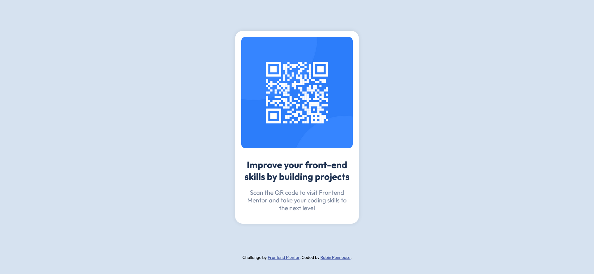

# Frontend Mentor - QR code component solution

This is a solution to the [QR code component challenge on Frontend Mentor](https://www.frontendmentor.io/challenges/qr-code-component-iux_sIO_H). Frontend Mentor challenges help you improve your coding skills by building realistic projects.

## Table of contents

- [Overview](#overview)
  - [Screenshot](#screenshot)
  - [Links](#links)
- [My process](#my-process)
  - [Built with](#built-with)
  - [What I learned](#what-i-learned)
  - [Continued development](#continued-development)
  - [Useful resources](#useful-resources)
- [Author](#author)

## Overview

### Screenshot




### Links

- Solution URL: [GitHub Repository](https://github.com/robinpunn/frontend-mentor/tree/main/qr-code-component-main)
- Live Site URL: [Add live site URL here](https://your-live-site-url.com)

## My process

### Built with

- Semantic HTML5 markup
- CSS custom properties
- Flexbox
- Mobile-first workflow

### What I learned

I am still trying to figure out the best ways to utilize margin and padding.  I placed the image in a div container and gave the container padding.
```css
.qr-code {
  padding: 0.5rem 0.5rem;
}
```
I put the text in a div container and gave the container margin.
```css
.text {
  text-align: center;
  margin: 0 0.75rem 0.5rem 0.75rem;
}
```
I tend to use a lot of div containers to separate different sections.

### Continued development

My goal is to build a strong foundation in CSS. I used Flexbox for this project. In the future I would like to use grid.  I'd also like to be able to use the box model more effectively.


### Useful resources

- [How to import google fonts in css file](https://www.w3docs.com/snippets/css/how-to-import-google-fonts-in-css-file.html) - This helped me understand how to import google fonts in css file.
- [CSS Variables](https://www.w3schools.com/css/css3_variables.asp) - I'm trying to utilize all the features of CSS and this helped me understand how to use CSS variables.

## Author

- Website - [Robin Punnoose](https://www.robinpunn.com)
- Frontend Mentor - [@robinpunn](https://www.frontendmentor.io/profile/robinpunn)
- LinkedIn - [@robin-punnoose](https://www.linkedin.com/in/robin-punnoose)